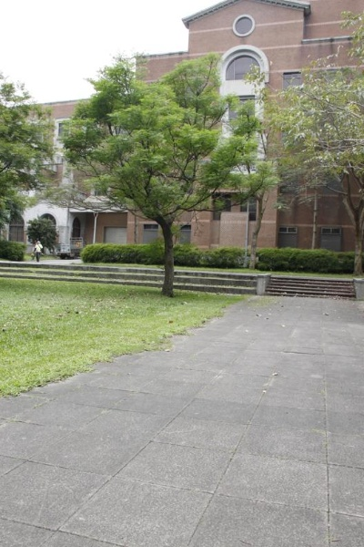
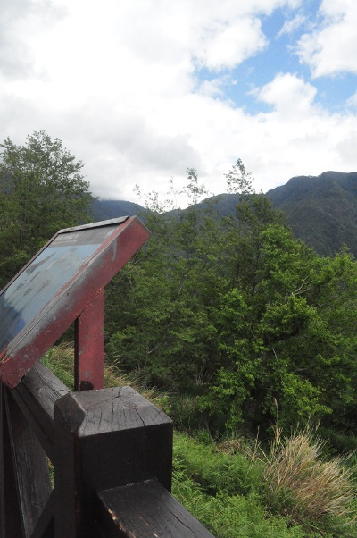
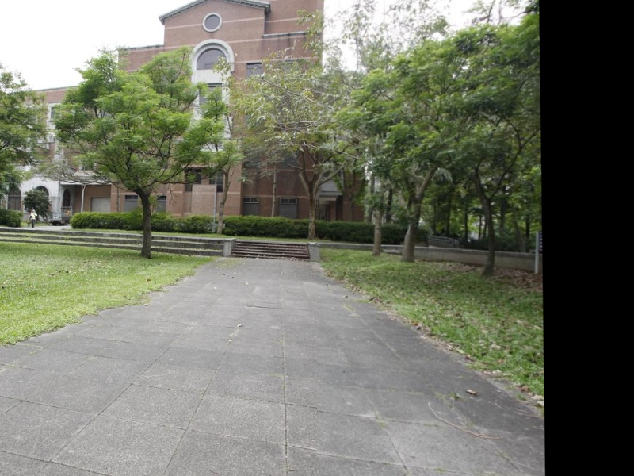
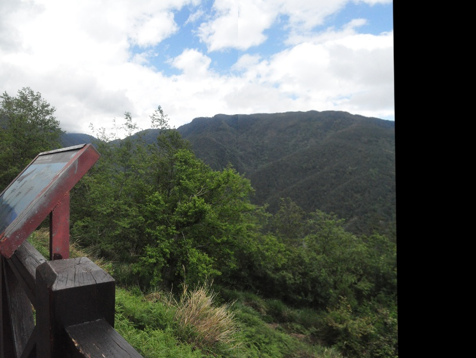
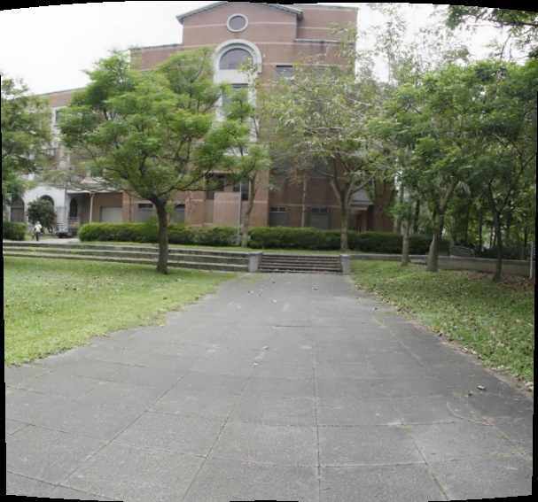
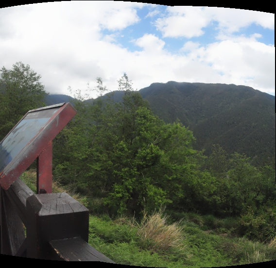

# stitching

A cpp example demonstrate how to do image stitching by opencv3

I give two solutions a shot, one of them is based on the [pyimagesearch blog](http://www.pyimagesearch.com/2016/01/11/opencv-panorama-stitching/),
another one use the Stitcher class of opencv.

#Images we want to stitch

# Results of PyimageSearch solution

# Results of OpenCV solution

